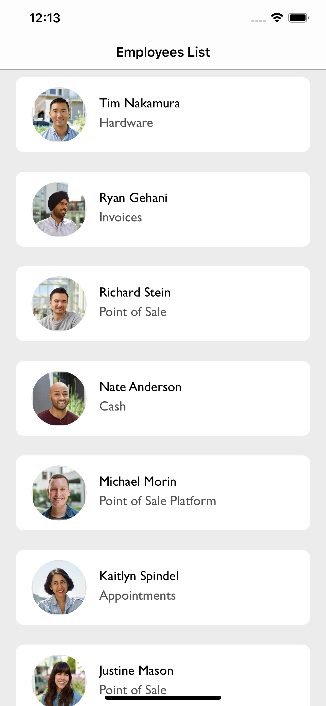
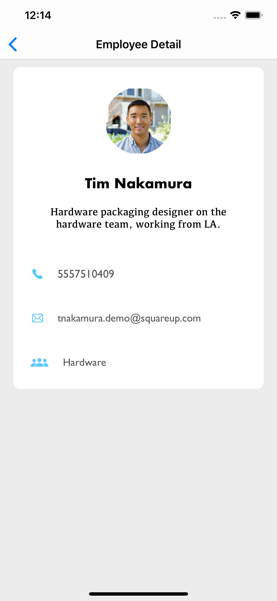

 
 

 <h2> Employee Directory App </h2>

 

 
## Summary

This is a small employee directory application where all the employees feeds are coming from an  API. All the employees feed will populate in the custom-designed tableView cell, and by tapping each section, the particular employee details  will open in a new view controller. 

 

## Build Tools & Versions Used

* Swift 5.0
* Xcode 11.5
* UITableViewController 
* UINavigationController

## Focus Areas

* Architechture and Design pattern
* JSON data formating & Data Fetching from the API
* Responsive  UI &  beautifying it. 

## Copied-in Code

* I copied code some code from my previous project related to designing UI. Thats all. 

## Tablet / Phone 

* I focused on iPhone and iPad both. It will work both devices. 

## Hours spendt on Project 

* I spent 5  hours to develop this project and did some refactor as well. made sure everything working fine. 

## Note
I wrote some simple Unit test case , just to show my ability but I am capable to write UI test and Unit test both. 

